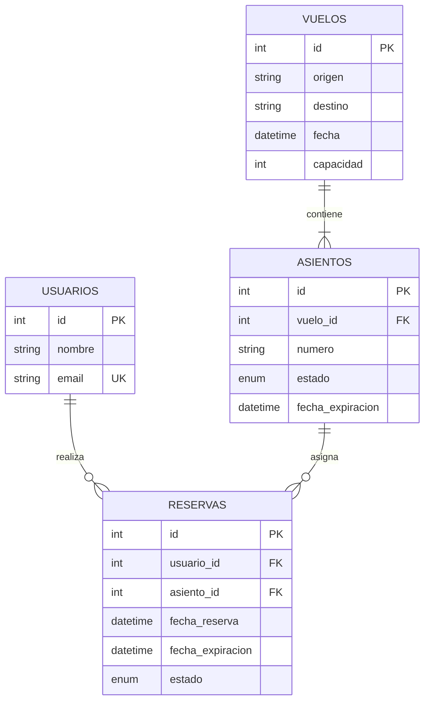

# Diagrama entidad-relacion

```mermaid
erDiagram
    USUARIOS ||--o{ RESERVAS : realiza
    VUELOS ||--|{ ASIENTOS : contiene
    ASIENTOS ||--o{ RESERVAS : asigna

    USUARIOS {
        int id PK
        string nombre
        string email UK
    }

    VUELOS {
        int id PK
        string origen
        string destino
        datetime fecha
        int capacidad
    }

    ASIENTOS {
        int id PK
        int vuelo_id FK
        string numero
        enum estado
        datetime fecha_expiracion
    }

    RESERVAS {
        int id PK
        int usuario_id FK
        int asiento_id FK
        datetime fecha_reserva
        datetime fecha_expiracion
        enum estado
    }
```

Regla de integridad: un asiento puede tener como máximo una reserva activa en estado `PENDIENTE` o `CONFIRMADA`. Las reservas `CANCELADA` quedan como historial.
