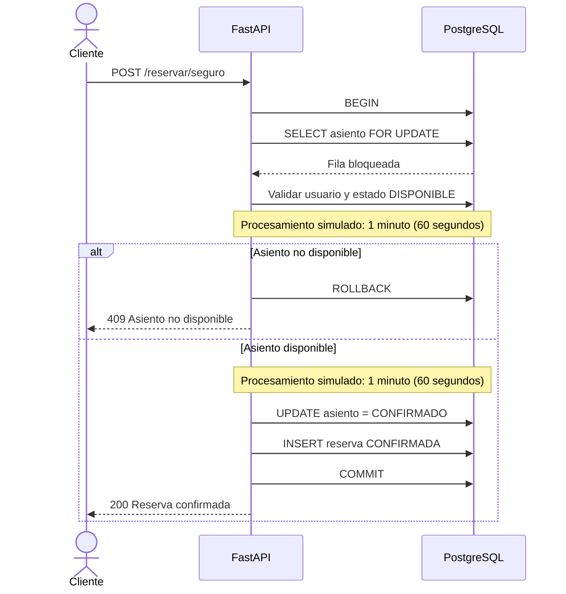

# Diagrama de secuencia de reserva

El bloqueo de fila serializa las solicitudes que intentan asignar el mismo asiento. La transacción se mantiene abierta durante el procesamiento simulado de un minuto y se libera al ejecutar `COMMIT`.
