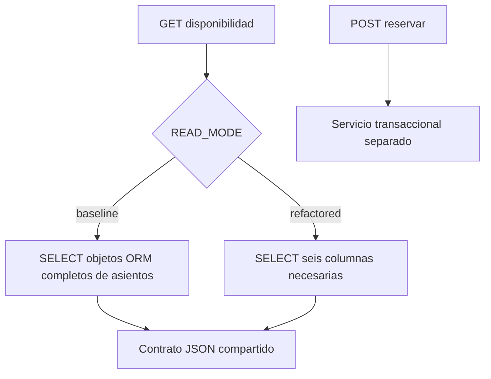

# Objetivo 2: baseline y refactorización de disponibilidad

Se conserva el contrato de disponibilidad y se comparan dos implementaciones seleccionadas al arranque mediante `READ_MODE`. Ambas consultan PostgreSQL sin locks de fila y con `CACHE_ENABLED=false`. La variante baseline reproduce la materialización ORM del servicio encontrado al iniciar esta revisión; no pretende reconstruir ni auditar el sistema de BoA.

La refactorización evita construir entidades ORM de cada asiento y seleccionar campos que no se usan en el mapa. Se conserva el orden por ID y el cálculo de disponibilidad. No se atribuye una reducción de número de consultas: ambas variantes ejecutan consulta del vuelo y de sus asientos. La mejora esperada es menos trabajo de materialización; su magnitud se mide.

La separación de routers y servicios ya existía en el commit de entrada. No se inventa una arquitectura monolítica anterior ni se atribuye causalmente toda mejora a CQRS. El test de equivalencia compara JSON y el test PostgreSQL mantiene una escritura bloqueada mientras consulta disponibilidad.

El [protocolo](../testing/protocolo_pruebas_estres.md) fija las variables del experimento. El [informe](../entregables/objetivos_1_2.md) registra resultados, incluido cualquier umbral incumplido. Un nivel de 500 VU es una prueba de laboratorio, no una estimación documentada del tráfico institucional.

La variante final refactorizada también declara `VueloDisponibilidadResponse` para validar y serializar con Pydantic. Baseline conserva la serialización genérica anterior. Por tanto, el tratamiento experimental combina proyección SQL y serialización tipada; no se atribuye todo el efecto a una sola técnica. Cambiar `READ_MODE` requiere reiniciar la API.
