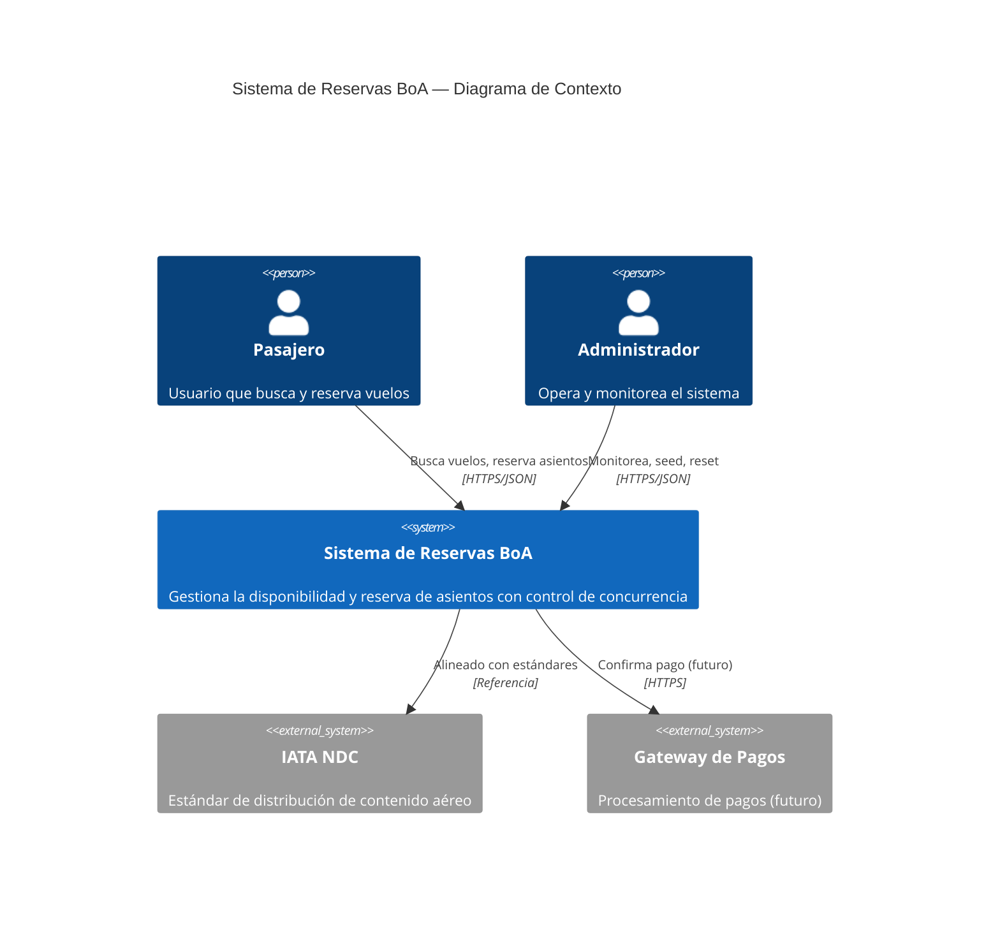
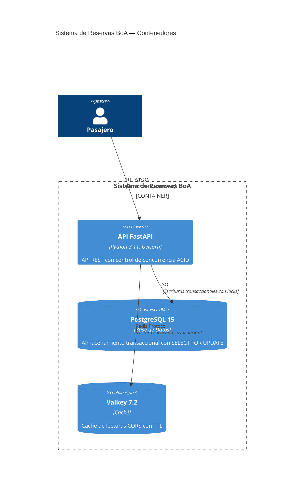
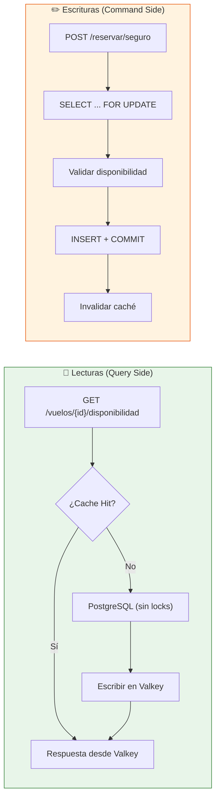
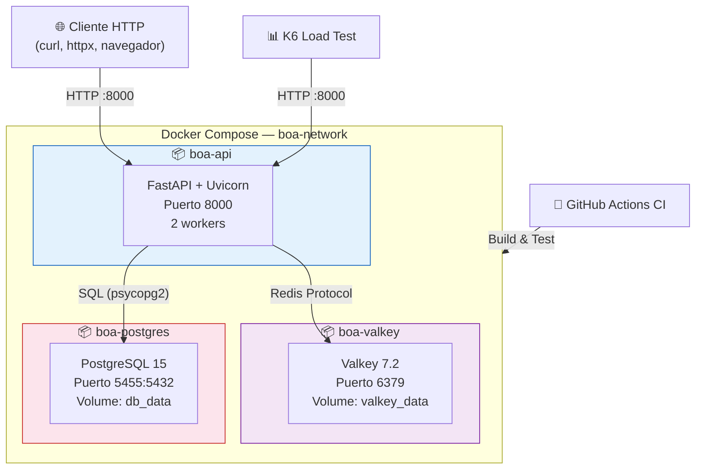

# Diagrama de Arquitectura del Sistema

## Arquitectura de Alto Nivel (C4 — Context)

## Arquitectura de Contenedores (C4 — Container)

## Flujo CQRS (Command Query Responsibility Segregation)

## Diagrama de Deployment (Docker Compose)

