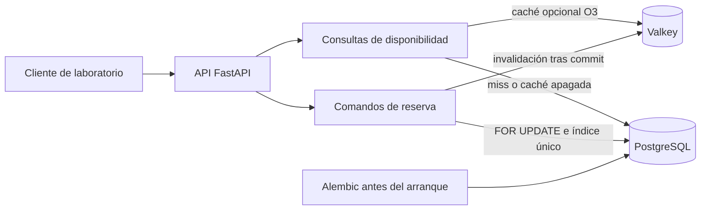

# Arquitectura del prototipo

Monolito modular FastAPI, PostgreSQL como autoridad transaccional y Valkey opcional para consultas. La separación CQRS es lógica: no hay event sourcing, broker, réplica de lectura ni microservicios. IATA es referencia documental, no un sistema externo conectado.

```mermaid
flowchart LR
  U[Cliente de laboratorio] --> A[API FastAPI]
  A --> Q[Consultas de disponibilidad]
  A --> C[Comandos de reserva]
  Q -->|caché opcional O3| V[(Valkey)]
  Q -->|miss o caché apagada| P[(PostgreSQL)]
  C -->|FOR UPDATE e índice único| P
  C -->|invalidación tras commit| V
  M[Alembic antes del arranque] --> P
```

El host publica API en 127.0.0.1:8000 y PostgreSQL en 127.0.0.1:5455. Compose ejecuta dos workers; cada uno mantiene su pool de 10 conexiones y hasta 20 adicionales. Planificar el total de conexiones antes de escalar: workers × (pool + overflow), más migrador y administración. Valkey no publica puertos.

## Consistencia y fallos

La reserva comprueba la fila bloqueada y escribe asiento/reserva en la misma transacción. El índice único parcial aporta una segunda barrera cuando una ruta omite el lock. El lector no adquiere un lock de fila; PostgreSQL puede mostrar el último estado confirmado mientras hay una escritura pendiente.

Confirmación y expiración bloquean reserva y asiento. No se introducen llamadas de pago dentro de una transacción. La demora de 60 segundos del prototipo anterior se desactiva por defecto y solo sirve para demostraciones puntuales.

La caché usa cache-aside e invalidación posterior al commit. Existe una ventana en que un lector anterior podría repoblar datos obsoletos después de invalidar: resolver/versionar y medir en O3. Por eso está apagada por defecto y nunca garantiza disponibilidad final. Un fallo de caché permite ir a PostgreSQL; un fallo de PostgreSQL impide readiness.

## Modelo y límites

Ver [ER](../diagramas/diagrama_er.md). Cada asiento pertenece a una instancia simplificada de vuelo. Las cancelaciones por TTL conservan historial; no hay tarifa, pago, boleto, check-in ni control de acceso por pasajero. El modelo de vuelo identifica código único y no representa todavía múltiples fechas del mismo número comercial.

La migración inicial aplica a bases nuevas. No se hace `stamp head` sobre una base antigua sin inspección. La [guía de operación](../operacion/despliegue.md) explica respaldo, adopción de esquema y reversión.
