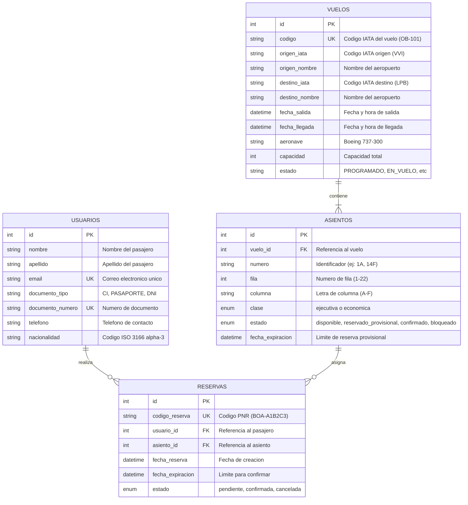

# Diagrama Entidad-Relación (v2.0)

## Modelo de Datos — Sistema de Reservas BoA

## Reglas de Integridad

1. **Índice único parcial**: Un asiento puede tener como máximo **una** reserva activa (`pendiente` o `confirmada`). Las reservas `cancelada` permanecen como historial.

2. **Claves foráneas**:
   - `asientos.vuelo_id → vuelos.id` (CASCADE DELETE)
   - `reservas.usuario_id → usuarios.id` (RESTRICT)
   - `reservas.asiento_id → asientos.id` (RESTRICT)

3. **Códigos únicos**: `vuelos.codigo` y `reservas.codigo_reserva` son únicos globalmente.

## Configuración del Boeing 737-300 de BoA

| Clase | Filas | Columnas | Asientos |
|-------|-------|----------|----------|
| Ejecutiva | 1-3 | A-F (3-3) | 18 |
| Económica | 4-22 | A-F (3-3) | 114 |
| **Total** | | | **132** |

## Aeropuertos de Bolivia (IATA)

| Código | Aeropuerto | Ciudad |
|--------|-----------|--------|
| VVI | Viru Viru International | Santa Cruz |
| LPB | El Alto International | La Paz |
| CBB | Jorge Wilstermann | Cochabamba |
| SRE | Alcantarí | Sucre |
| TJA | Capitán Oriel Lea Plaza | Tarija |
| ORU | Juan Mendoza | Oruro |
| TDD | Teniente Jorge Henrich Arauz | Trinidad |
| CIJ | Capitán Aníbal Arab | Cobija |
