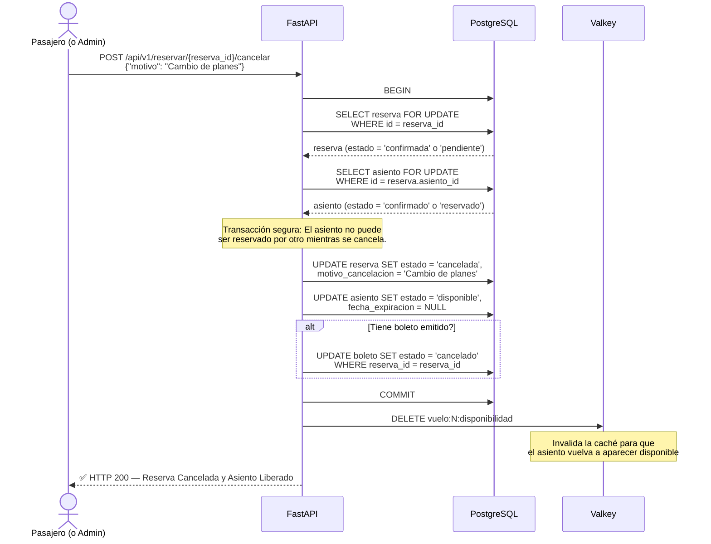

# Diagrama de Secuencia — Cancelación de Reserva

Este flujo ilustra cómo una reserva es cancelada de manera segura, liberando el asiento y marcando el boleto como anulado.

```mermaid
sequenceDiagram
    actor P as Pasajero (o Admin)
    participant API as FastAPI
    participant DB as PostgreSQL
    participant Cache as Valkey

    P->>API: POST /api/v1/reservar/{reserva_id}/cancelar<br/>{"motivo": "Cambio de planes"}

    API->>DB: BEGIN
    API->>DB: SELECT reserva FOR UPDATE<br/>WHERE id = reserva_id
    DB-->>API: reserva (estado = 'confirmada' o 'pendiente')

    API->>DB: SELECT asiento FOR UPDATE<br/>WHERE id = reserva.asiento_id
    DB-->>API: asiento (estado = 'confirmado' o 'reservado')

    Note over API: Transacción segura: El asiento no puede<br/>ser reservado por otro mientras se cancela.

    API->>DB: UPDATE reserva SET estado = 'cancelada',<br/>motivo_cancelacion = 'Cambio de planes'
    API->>DB: UPDATE asiento SET estado = 'disponible',<br/>fecha_expiracion = NULL

    alt Tiene boleto emitido?
        API->>DB: UPDATE boleto SET estado = 'cancelado'<br/>WHERE reserva_id = reserva_id
    end

    API->>DB: COMMIT

    API->>Cache: DELETE vuelo:N:disponibilidad
    Note over Cache: Invalida la caché para que<br/>el asiento vuelva a aparecer disponible

    API-->>P: ✅ HTTP 200 — Reserva Cancelada y Asiento Liberado
```
