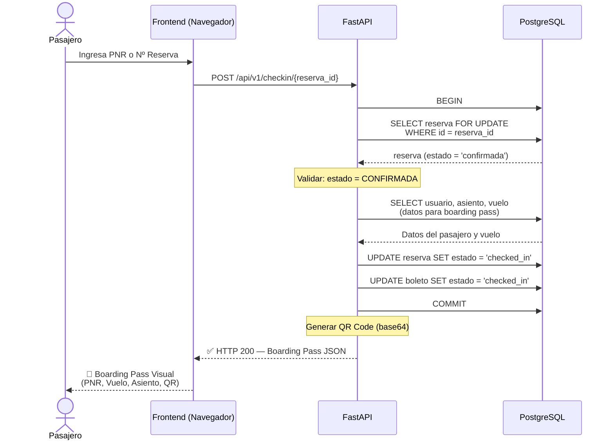
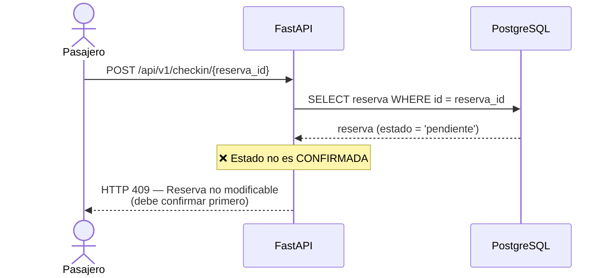
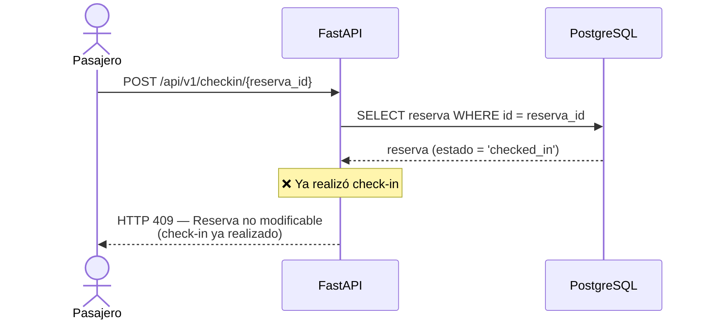

# Diagramas de Secuencia — Check-in Web

## 1. Check-in Exitoso con Boarding Pass

## 2. Check-in Rechazado — Reserva No Confirmada

## 3. Check-in Rechazado — Ya Realizado

## Datos del Boarding Pass

El boarding pass generado contiene:

| Campo | Ejemplo | Fuente |
|-------|---------|--------|
| PNR | BOA-A1B2C3 | `reservas.codigo_reserva` |
| Nº Boleto | 930-1234567890 | `boletos.numero_boleto` |
| Pasajero | Juan Mamani | `usuarios.nombre + apellido` |
| Documento | CI 12345678 | `usuarios.documento_tipo + numero` |
| Vuelo | OB-101 | `vuelos.codigo` |
| Origen → Destino | VVI → LPB | `vuelos.origen_iata → destino_iata` |
| Fecha | 2026-10-15 06:00 | `vuelos.fecha_salida` |
| Asiento | 14A | `asientos.numero` |
| Clase | Económica | `asientos.clase` |
| Grupo Embarque | B | Calculado (A=ejecutiva, B=económica) |
| Puerta | 12 | Asignado por el sistema |
| QR Code | base64(...) | JSON codificado con datos clave |
