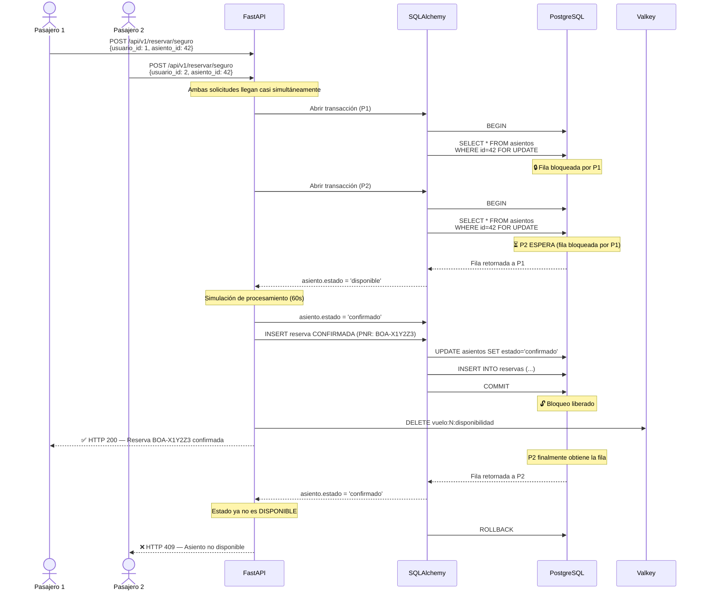
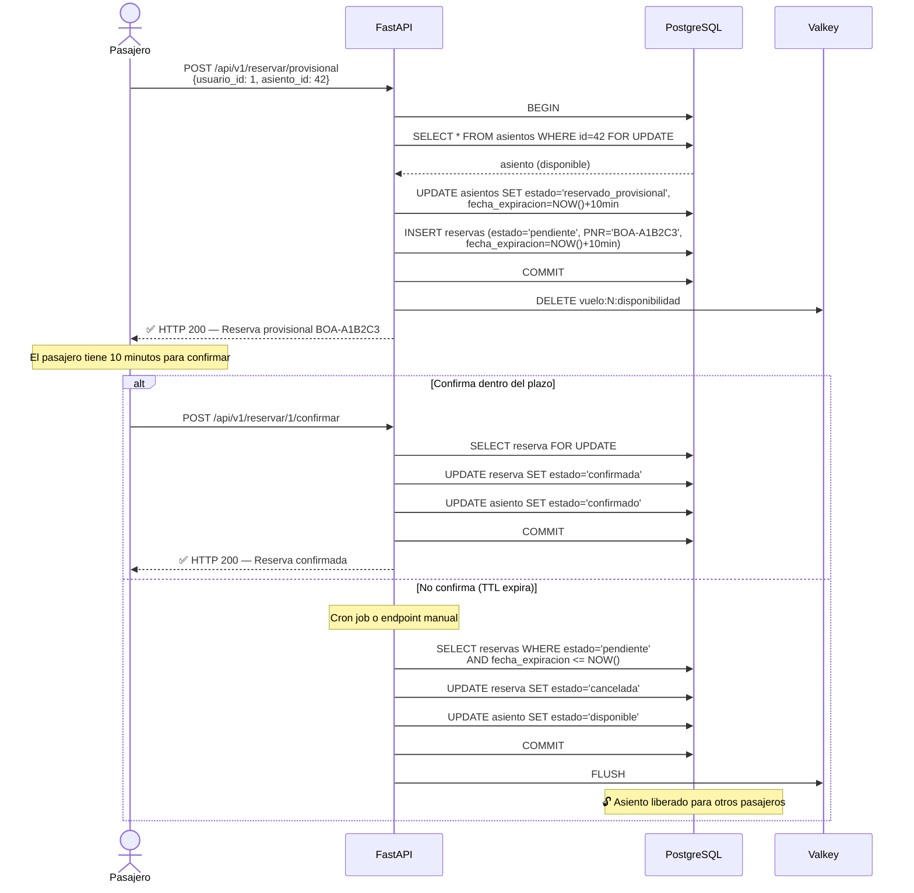
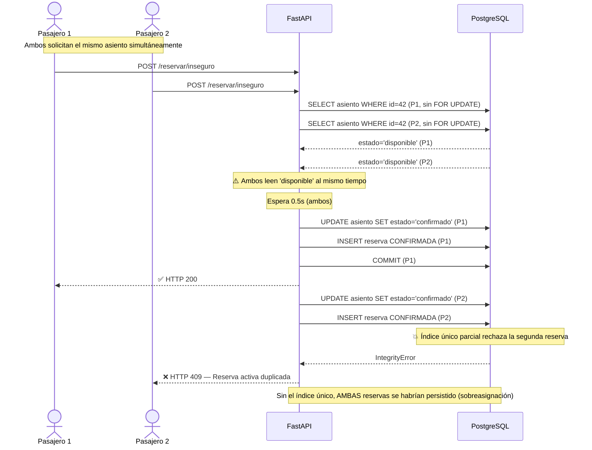

# Diagramas de Secuencia — Control de Concurrencia

## 1. Reserva Segura (SELECT FOR UPDATE)

```mermaid
sequenceDiagram
    actor P1 as Pasajero 1
    actor P2 as Pasajero 2
    participant API as FastAPI
    participant ORM as SQLAlchemy
    participant DB as PostgreSQL
    participant Cache as Valkey

    P1->>API: POST /api/v1/reservar/seguro<br/>{usuario_id: 1, asiento_id: 42}
    P2->>API: POST /api/v1/reservar/seguro<br/>{usuario_id: 2, asiento_id: 42}

    Note over API: Ambas solicitudes llegan casi simultáneamente

    API->>ORM: Abrir transacción (P1)
    ORM->>DB: BEGIN
    ORM->>DB: SELECT * FROM asientos<br/>WHERE id=42 FOR UPDATE

    Note over DB: 🔒 Fila bloqueada por P1

    API->>ORM: Abrir transacción (P2)
    ORM->>DB: BEGIN
    ORM->>DB: SELECT * FROM asientos<br/>WHERE id=42 FOR UPDATE

    Note over DB: ⏳ P2 ESPERA (fila bloqueada por P1)

    DB-->>ORM: Fila retornada a P1
    ORM-->>API: asiento.estado = 'disponible'

    Note over API: Simulación de procesamiento (60s)

    API->>ORM: asiento.estado = 'confirmado'
    API->>ORM: INSERT reserva CONFIRMADA (PNR: BOA-X1Y2Z3)
    ORM->>DB: UPDATE asientos SET estado='confirmado'
    ORM->>DB: INSERT INTO reservas (...)
    ORM->>DB: COMMIT

    Note over DB: 🔓 Bloqueo liberado

    API->>Cache: DELETE vuelo:N:disponibilidad
    API-->>P1: ✅ HTTP 200 — Reserva BOA-X1Y2Z3 confirmada

    Note over DB: P2 finalmente obtiene la fila

    DB-->>ORM: Fila retornada a P2
    ORM-->>API: asiento.estado = 'confirmado'

    Note over API: Estado ya no es DISPONIBLE

    ORM->>DB: ROLLBACK
    API-->>P2: ❌ HTTP 409 — Asiento no disponible
```

## 2. Reserva Provisional (TTL 10 min)

```mermaid
sequenceDiagram
    actor P as Pasajero
    participant API as FastAPI
    participant DB as PostgreSQL
    participant Cache as Valkey

    P->>API: POST /api/v1/reservar/provisional<br/>{usuario_id: 1, asiento_id: 42}

    API->>DB: BEGIN
    API->>DB: SELECT * FROM asientos WHERE id=42 FOR UPDATE
    DB-->>API: asiento (disponible)

    API->>DB: UPDATE asientos SET estado='reservado_provisional',<br/>fecha_expiracion=NOW()+10min
    API->>DB: INSERT reservas (estado='pendiente', PNR='BOA-A1B2C3',<br/>fecha_expiracion=NOW()+10min)
    API->>DB: COMMIT
    API->>Cache: DELETE vuelo:N:disponibilidad
    API-->>P: ✅ HTTP 200 — Reserva provisional BOA-A1B2C3

    Note over P: El pasajero tiene 10 minutos para confirmar

    alt Confirma dentro del plazo
        P->>API: POST /api/v1/reservar/1/confirmar
        API->>DB: SELECT reserva FOR UPDATE
        API->>DB: UPDATE reserva SET estado='confirmada'
        API->>DB: UPDATE asiento SET estado='confirmado'
        API->>DB: COMMIT
        API-->>P: ✅ HTTP 200 — Reserva confirmada
    else No confirma (TTL expira)
        Note over API: Cron job o endpoint manual
        API->>DB: SELECT reservas WHERE estado='pendiente'<br/>AND fecha_expiracion <= NOW()
        API->>DB: UPDATE reserva SET estado='cancelada'
        API->>DB: UPDATE asiento SET estado='disponible'
        API->>DB: COMMIT
        API->>Cache: FLUSH
        Note over DB: 🔓 Asiento liberado para otros pasajeros
    end
```

## 3. Flujo Inseguro (Race Condition)

```mermaid
sequenceDiagram
    actor P1 as Pasajero 1
    actor P2 as Pasajero 2
    participant API as FastAPI
    participant DB as PostgreSQL

    Note over P1,P2: Ambos solicitan el mismo asiento simultáneamente

    P1->>API: POST /reservar/inseguro
    P2->>API: POST /reservar/inseguro

    API->>DB: SELECT asiento WHERE id=42 (P1, sin FOR UPDATE)
    API->>DB: SELECT asiento WHERE id=42 (P2, sin FOR UPDATE)

    DB-->>API: estado='disponible' (P1)
    DB-->>API: estado='disponible' (P2)

    Note over API: ⚠️ Ambos leen 'disponible' al mismo tiempo

    Note over API: Espera 0.5s (ambos)

    API->>DB: UPDATE asiento SET estado='confirmado' (P1)
    API->>DB: INSERT reserva CONFIRMADA (P1)
    API->>DB: COMMIT (P1)
    API-->>P1: ✅ HTTP 200

    API->>DB: UPDATE asiento SET estado='confirmado' (P2)
    API->>DB: INSERT reserva CONFIRMADA (P2)

    Note over DB: 💥 Índice único parcial rechaza la segunda reserva

    DB-->>API: IntegrityError
    API-->>P2: ❌ HTTP 409 — Reserva activa duplicada

    Note over API,DB: Sin el índice único, AMBAS reservas se habrían persistido (sobreasignación)
```
