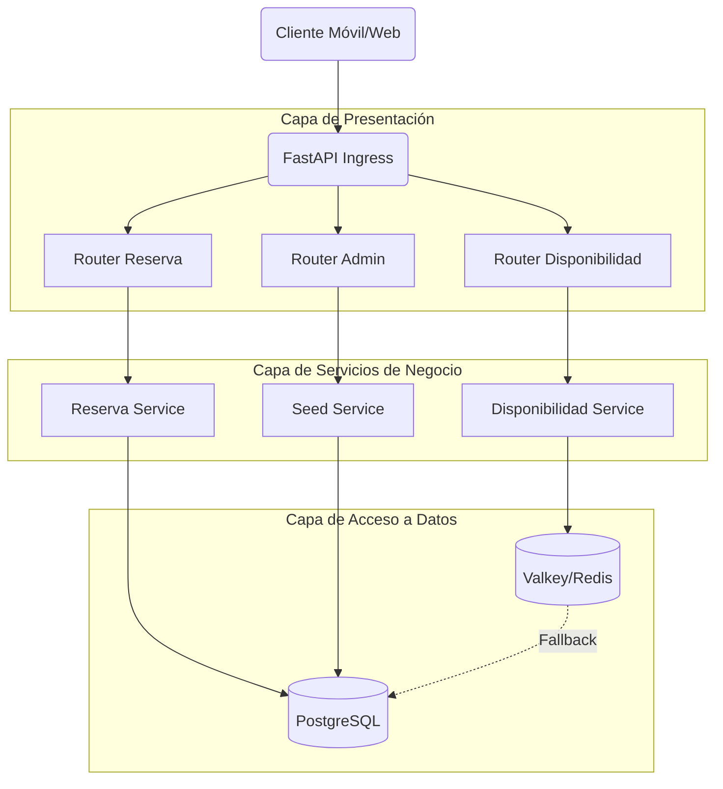

```mermaid
flowchart TB
    Client(Cliente Móvil/Web) --> API(FastAPI Ingress)
    
    subgraph Capa de Presentación
        API --> R_Reserva[Router Reserva]
        API --> R_Disp[Router Disponibilidad]
        API --> R_Admin[Router Admin]
    end
    
    subgraph Capa de Servicios de Negocio
        R_Reserva --> S_Reserva[Reserva Service]
        R_Disp --> S_Disp[Disponibilidad Service]
        R_Admin --> S_Seed[Seed Service]
    end
    
    subgraph Capa de Acceso a Datos
        S_Reserva --> DB[(PostgreSQL)]
        S_Seed --> DB
        S_Disp --> Cache[(Valkey/Redis)]
        Cache -. Fallback .-> DB
    end
```
