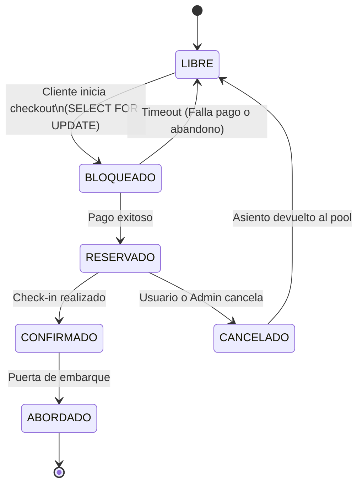

```mermaid
stateDiagram-v2
    [*] --> LIBRE
    LIBRE --> BLOQUEADO : Cliente inicia checkout\n(SELECT FOR UPDATE)
    BLOQUEADO --> LIBRE : Timeout (Falla pago o abandono)
    BLOQUEADO --> RESERVADO : Pago exitoso
    RESERVADO --> CONFIRMADO : Check-in realizado
    RESERVADO --> CANCELADO : Usuario o Admin cancela
    CONFIRMADO --> ABORDADO : Puerta de embarque
    CANCELADO --> LIBRE : Asiento devuelto al pool
    ABORDADO --> [*]
```
