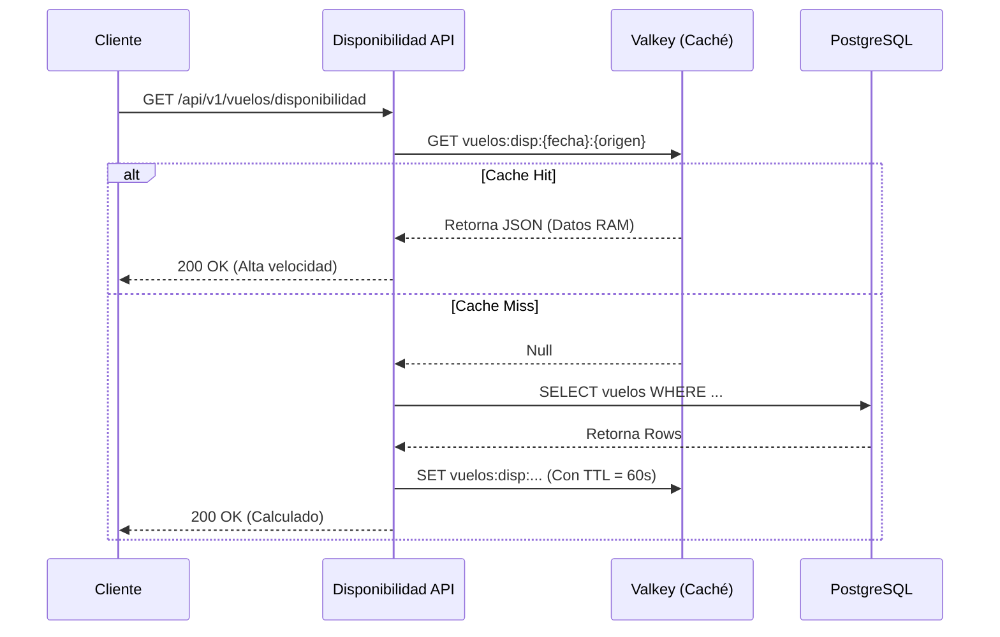

```mermaid
sequenceDiagram
    participant C as Cliente
    participant API as Disponibilidad API
    participant Valkey as Valkey (Caché)
    participant DB as PostgreSQL
    
    C->>API: GET /api/v1/vuelos/disponibilidad
    API->>Valkey: GET vuelos:disp:{fecha}:{origen}
    
    alt Cache Hit
        Valkey-->>API: Retorna JSON (Datos RAM)
        API-->>C: 200 OK (Alta velocidad)
    else Cache Miss
        Valkey-->>API: Null
        API->>DB: SELECT vuelos WHERE ...
        DB-->>API: Retorna Rows
        API->>Valkey: SET vuelos:disp:... (Con TTL = 60s)
        API-->>C: 200 OK (Calculado)
    end
```
