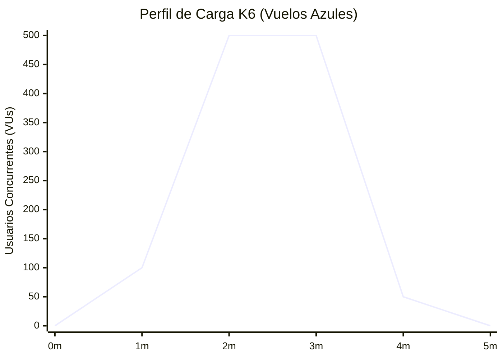

```mermaid
xychart-beta
    title "Perfil de Carga K6 (Vuelos Azules)"
    x-axis ["0m", "1m", "2m", "3m", "4m", "5m"]
    y-axis "Usuarios Concurrentes (VUs)" 0 --> 500
    line [0, 100, 500, 500, 50, 0]
```
