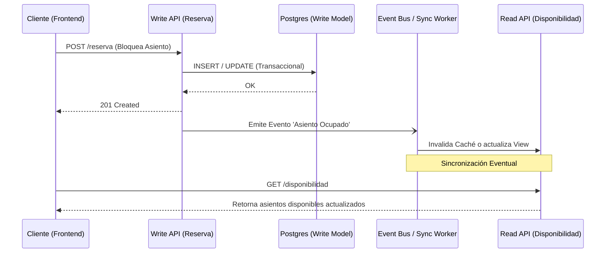

```mermaid
sequenceDiagram
    participant C as Cliente (Frontend)
    participant W as Write API (Reserva)
    participant DB as Postgres (Write Model)
    participant E as Event Bus / Sync Worker
    participant R as Read API (Disponibilidad)
    
    C->>W: POST /reserva (Bloquea Asiento)
    W->>DB: INSERT / UPDATE (Transaccional)
    DB-->>W: OK
    W-->>C: 201 Created
    
    W-)E: Emite Evento 'Asiento Ocupado'
    E->>R: Invalida Caché o actualiza View
    note over E,R: Sincronización Eventual
    
    C->>R: GET /disponibilidad
    R-->>C: Retorna asientos disponibles actualizados
```
