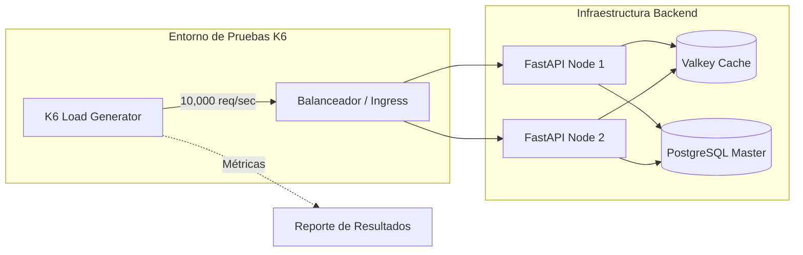

```mermaid
flowchart LR
    subgraph Entorno de Pruebas K6
        K6[K6 Load Generator] --> |10,000 req/sec| LB[Balanceador / Ingress]
    end
    
    subgraph Infraestructura Backend
        LB --> API1[FastAPI Node 1]
        LB --> API2[FastAPI Node 2]
        
        API1 --> Cache[(Valkey Cache)]
        API2 --> Cache
        
        API1 --> DB[(PostgreSQL Master)]
        API2 --> DB
    end
    
    K6 -. Métricas .-> Grafana[Reporte de Resultados]
```
