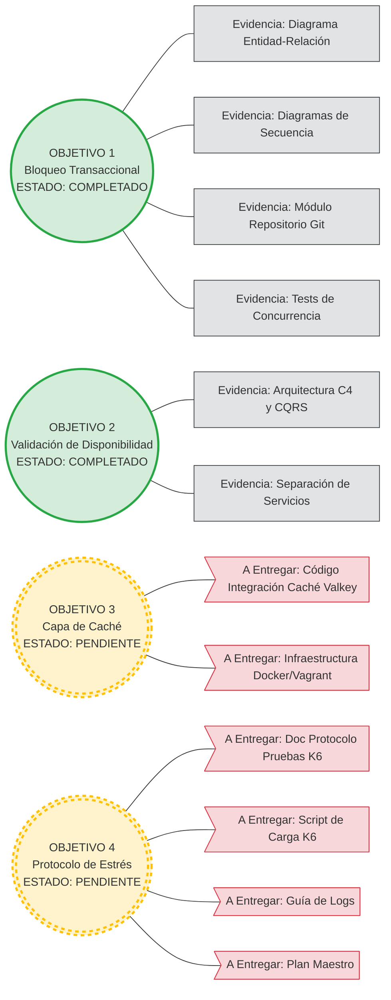

# Mapa de Evidencias por Objetivo

```mermaid
flowchart LR
    %% OBJETIVO 1
    O1((OBJETIVO 1\nBloqueo Transaccional\nESTADO: COMPLETADO))
    O1_1[Evidencia: Diagrama Entidad-Relación]
    O1_2[Evidencia: Diagramas de Secuencia]
    O1_3[Evidencia: Módulo Repositorio Git]
    O1_4[Evidencia: Tests de Concurrencia]
    
    O1 --- O1_1
    O1 --- O1_2
    O1 --- O1_3
    O1 --- O1_4

    %% OBJETIVO 2
    O2((OBJETIVO 2\nValidación de Disponibilidad\nESTADO: COMPLETADO))
    O2_1[Evidencia: Arquitectura C4 y CQRS]
    O2_2[Evidencia: Separación de Servicios]
    
    O2 --- O2_1
    O2 --- O2_2

    %% OBJETIVO 3
    O3(((OBJETIVO 3\nCapa de Caché\nESTADO: PENDIENTE)))
    O3_1>A Entregar: Código Integración Caché Valkey]
    O3_2>A Entregar: Infraestructura Docker/Vagrant]
    
    O3 --- O3_1
    O3 --- O3_2

    %% OBJETIVO 4
    O4(((OBJETIVO 4\nProtocolo de Estrés\nESTADO: PENDIENTE)))
    O4_1>A Entregar: Doc Protocolo Pruebas K6]
    O4_2>A Entregar: Script de Carga K6]
    O4_3>A Entregar: Guía de Logs]
    O4_4>A Entregar: Plan Maestro]
    
    O4 --- O4_1
    O4 --- O4_2
    O4 --- O4_3
    O4 --- O4_4

    %% ESTILOS
    classDef completado fill:#d4edda,stroke:#28a745,stroke-width:3px;
    classDef pendiente fill:#fff3cd,stroke:#ffc107,stroke-width:3px,stroke-dasharray: 5 5;
    classDef ev_completada fill:#e2e3e5,stroke:#383d41,stroke-width:1px;
    classDef ev_pendiente fill:#f8d7da,stroke:#dc3545,stroke-width:1px;

    class O1,O2 completado;
    class O3,O4 pendiente;
    
    class O1_1,O1_2,O1_3,O1_4,O2_1,O2_2 ev_completada;
    class O3_1,O3_2,O4_1,O4_2,O4_3,O4_4 ev_pendiente;

```
