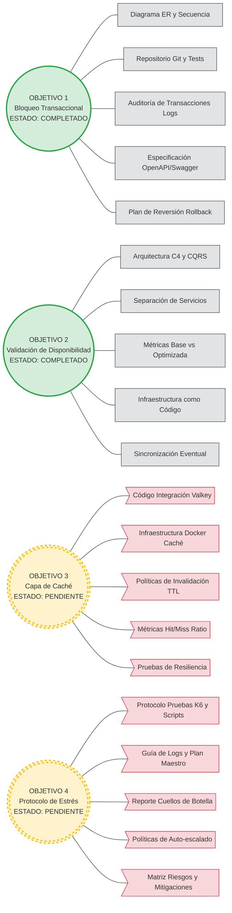

```mermaid
flowchart LR
    %% OBJETIVO 1
    O1((OBJETIVO 1\nBloqueo Transaccional\nESTADO: COMPLETADO))
    O1_1[Diagrama ER y Secuencia]
    O1_2[Repositorio Git y Tests]
    O1_3[Auditoría de Transacciones Logs]
    O1_4[Especificación OpenAPI/Swagger]
    O1_5[Plan de Reversión Rollback]
    
    O1 --- O1_1
    O1 --- O1_2
    O1 --- O1_3
    O1 --- O1_4
    O1 --- O1_5

    %% OBJETIVO 2
    O2((OBJETIVO 2\nValidación de Disponibilidad\nESTADO: COMPLETADO))
    O2_1[Arquitectura C4 y CQRS]
    O2_2[Separación de Servicios]
    O2_3[Métricas Base vs Optimizada]
    O2_4[Infraestructura como Código]
    O2_5[Sincronización Eventual]
    
    O2 --- O2_1
    O2 --- O2_2
    O2 --- O2_3
    O2 --- O2_4
    O2 --- O2_5

    %% OBJETIVO 3
    O3(((OBJETIVO 3\nCapa de Caché\nESTADO: PENDIENTE)))
    O3_1>Código Integración Valkey]
    O3_2>Infraestructura Docker Caché]
    O3_3>Políticas de Invalidación TTL]
    O3_4>Métricas Hit/Miss Ratio]
    O3_5>Pruebas de Resiliencia]
    
    O3 --- O3_1
    O3 --- O3_2
    O3 --- O3_3
    O3 --- O3_4
    O3 --- O3_5

    %% OBJETIVO 4
    O4(((OBJETIVO 4\nProtocolo de Estrés\nESTADO: PENDIENTE)))
    O4_1>Protocolo Pruebas K6 y Scripts]
    O4_2>Guía de Logs y Plan Maestro]
    O4_3>Reporte Cuellos de Botella]
    O4_4>Políticas de Auto-escalado]
    O4_5>Matriz Riesgos y Mitigaciones]
    
    O4 --- O4_1
    O4 --- O4_2
    O4 --- O4_3
    O4 --- O4_4
    O4 --- O4_5

    %% ESTILOS
    classDef completado fill:#d4edda,stroke:#28a745,stroke-width:3px;
    classDef pendiente fill:#fff3cd,stroke:#ffc107,stroke-width:3px,stroke-dasharray: 5 5;
    classDef ev_completada fill:#e2e3e5,stroke:#383d41,stroke-width:1px;
    classDef ev_pendiente fill:#f8d7da,stroke:#dc3545,stroke-width:1px;

    class O1,O2 completado;
    class O3,O4 pendiente;
    
    class O1_1,O1_2,O1_3,O1_4,O1_5,O2_1,O2_2,O2_3,O2_4,O2_5 ev_completada;
    class O3_1,O3_2,O3_3,O3_4,O3_5,O4_1,O4_2,O4_3,O4_4,O4_5 ev_pendiente;
```
